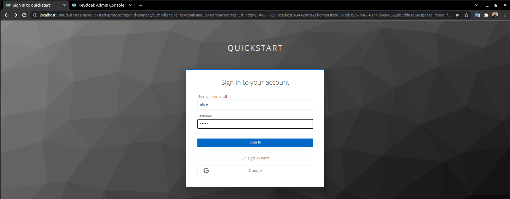

# KeycloakDemo

This project was generated with [Angular CLI](https://github.com/angular/angular-cli) version 13.1.2.


This demo was created to test how keycloak works.
## Previous steps:
    1. bring up the keycloak server
    2. configure keycloak
    3. establish connection between this app and keycloak  


##### 1. Bring up the keycloak server
You can follow this guide to have a instance of keycloack. https://www.keycloak.org/getting-started/getting-started-kube  

>To test it locally you will need to have previously installed mikube which allows you to run kubernetes clusters locally.  


Another easier and faster way to have a keycloak instance is by using **docker** and **docker-compoose**.
So you only need run the command ```docker-compose up```
and when it finish you will have a keycloak instance at http://localhost:8080.  

For default you will have an admin user with **user**:admin and **password**: admin


##### 2. configure keycloak
Inside your [Keycloak Admin Console](http://localhost:8080/auth/admin): 
+ You will need create a new realm with the name  **quickstart** for example.
+ You will need create two roles: **user** and **admin**.
+ You will need create one client with the name **keycloak-angular-demo** for example, in Root url you should put the url where this angular app is working that should be  `http://localhost:4200/`
+ And create minimum two users with their respective passwords.
Both must add the user role, but one of them must also add the admin role.

If you need help with it, you can review this [guide](https://www.keycloak.org/getting-started/getting-started-kube#:~:text=Click%20Create-,Create%20a%20user,-Initially%20there%20are)

optionally you can add the authorization with google following this [guide](https://keycloakthemes.com/blog/how-to-setup-sign-in-with-google-using-keycloak). If you do, you must configure keycloack so that each user who registers in the application is added the `user` role by default, you do this in the keycloack admin console inside Roles > Default roles and add the `user` role to the Realm Default Roles section.


##### 3. establish connection between this app and keycloak
if you used the names given as examples in this guide, you don't need to do anything else. in case you have used other names you will have to modify the properties url realm clientId in the file `src/app/app.module.ts`

## Development server

Run `ng serve` for a dev server. Navigate to `http://localhost:4200/`. The app will automatically reload if you change any of the source files.
If you followed all the steps you should see the following interface:
  


## Screenshoots
Protected page. only for users with role user
  


Admin page. only for users with roles user and admin
  


Google login option
  

user role for default
  